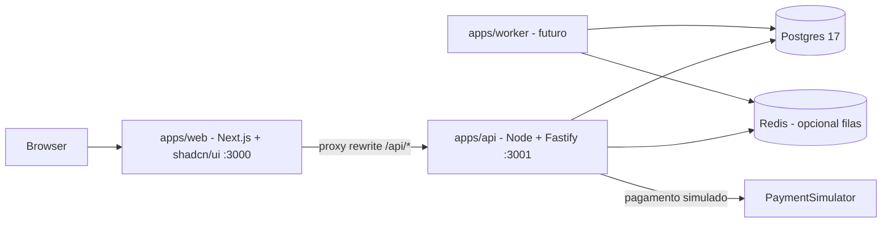
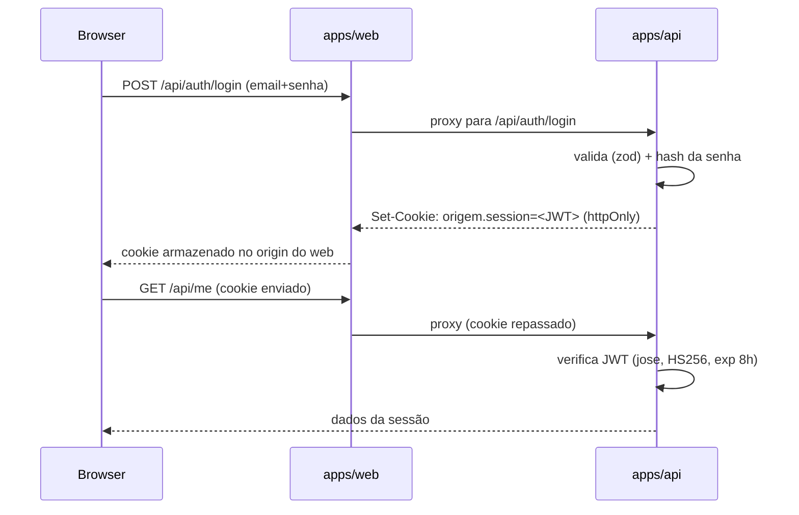
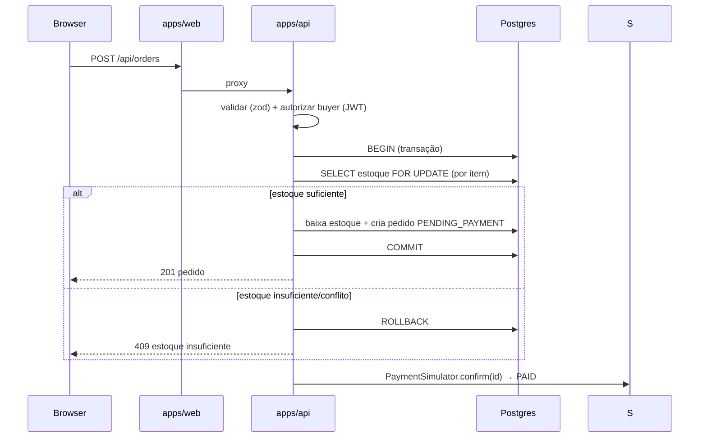

# Visão Arquitetural

## Princípios

- **Monorepo npm workspaces** com `apps/*`:
  - `apps/web` — **Next.js + shadcn/ui** (o front): vitrine, painéis, UI.
  - `apps/api` — **Node.js + Fastify** (a API): dados, regras, autenticação.
  - `apps/worker` — jobs assíncronos (planejado; ver seção Worker).
- **Camadas claras na API**: `routes → services → domain → repositories`.
  Regras de negócio no **domínio**, nunca em componentes ou rotas.
- **SOLID/GRASP**: módulos com responsabilidade única; injeção simples; baixo
  acoplamento. Módulos = `catalog`, `cart`, `orders`, `reviews`,
  `recommendation`, `dashboard`, `identity`.
- **Web é próxima de dumb client**: renderiza e chama a API; não acessa banco.

## Contêineres



- **Browser só fala com `apps/web`** (porta 3000). Chamadas a `/api/*` são
  **proxeadas** pelo Next (`next.config.ts` rewrites) para `apps/api`,
  mantendo cookie e CORS no mesmo origin.
- **`apps/api`** (porta 3001) expõe REST sob `/api`, possui Prisma (schema,
  migrações, seed), validação Zod e sessão JWT.
- **Postgres** — fonte da verdade, migrado via Prisma.
- **Pagamento**: `PaymentSimulator`, sempre simulado (ADR-002).

## Estrutura

```
apps/web/
  src/
    app/(storefront)/      # rotas públicas (home, busca, produto, artesão)
    app/(artisan)/painel   # painel do artesão
    app/admin/             # painel administrativo
    components/ui/         # shadcn/ui (Button, Card, Badge, ...)
    components/*/          # por feature (storefront, artisan, admin)
    lib/                   # api client (fetch p/ API), money, format
apps/api/
  src/
    index.ts               # bootstrap (lê PORT, .env)
    app.ts                 # buildServer() Fastify — testável com .inject()
    config.ts              # env validada com Zod
    routes/                # rotas REST por domínio (/api/health, ...)
    server/domain/         # entidades, enums, regras de negócio
    server/services/       # casos de uso
    server/repositories/   # Prisma + interfaces
    server/auth/           # sessão JWT (jose), guards, cookie
  prisma/                  # schema, migrações, seed
  .env                     # DATABASE_URL, JWT_SECRET, PORT=3001
apps/worker/               # planejado
```

## Autenticação (JWT em cookie httpOnly)



- Token assinado em `apps/api/src/server/auth/session.ts`; nunca exposto a JS.
- Papéis `BUYER | ARTISAN | ADMIN` checam guards nas rotas + escopo por recurso.

## Fluxo de compra (núcleo de concorrência)



## Recomendação e indicadores

- **Recomendação (n1)**: similaridade por `categoria ∩ origem`, ordenada por
  média de avaliação; consulta SQL agregada na API.
- **Evolução (n2)**: scoring de navegação pré-computado no `worker` em
  `RecommendationCache`.
- **Indicadores**: agregações no banco (`GROUP BY`, janelas de tempo); snapshots
  diários via worker quando ficarem pesados. Nunca agrega no cliente.

## Padrões técnicos

| Assunto | Decisão |
|---|---|
| Front | Next.js (App Router) + Tailwind + shadcn/ui |
| API | Node + Fastify (v5), REST sob `/api` |
| ORM | Prisma (schema em `apps/api/prisma`) |
| Validação | Zod no servidor (api); tipos inferidos |
| Sessão | JWT (jose) em cookie httpOnly; `SESSION_COOKIE=origem.session` |
| Proxy web→api | `next.config.ts` rewrites (`API_INTERNAL_URL`) |
| Testes | Vitest (web e api) + Playwright (E2E — a implementar) |
| Filas | BullMQ + Redis (opcional, worker futuro) |
| Pagamento | `PaymentSimulator` (modo `simulated`) |

## Worker (planejado)

`apps/worker` entra quando houver jobs: pré-computação de recomendação,
snapshots de indicadores, notificações simuladas. Consumo via fila (Redis) com
fallback inline em dev. Sem Redis: executar sob demanda a partir da API.

## Rastreamento de decisões

- ADR-001: stack (monorepo TS).
- ADR-002: pagamento simulado.
- ADR-003: separação `apps/web` (front) e `apps/api` (Fastify).
- Atualize este documento junto com mudanças reais de arquitetura.