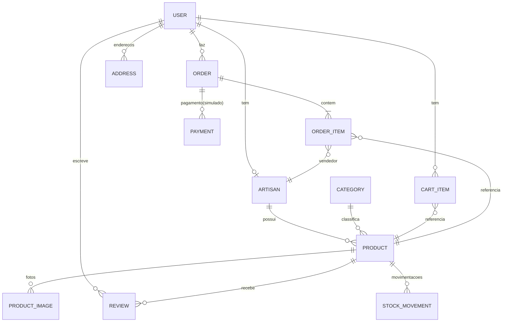

# Modelo de Dados

Banco: **PostgreSQL 17**. ORM: **Prisma** (schema em `apps/api/prisma/schema.prisma`).
Relações modeladas abaixo; migrações versionadas em `apps/api/prisma/migrations`.

## Diagrama



## Entidades principais

### User
- `id`, `name`, `email` (unique), `passwordHash`, `role` (`BUYER|ARTISAN|ADMIN`),
  `status` (usado p/ artesão: `PENDING|ACTIVE|REJECTED`), `createdAt`.
- Email como campo de login; consentimento LGPD registrado (`consentLoggedAt`).

### Artisan
- `id`, `userId` (1:1), `bio`, `story`, `city`, `uf` (default PE), `origin` texto
  livre, `status` (espelha aprovação), `avatarUrl`.

### Category
- `id`, `name`, `slug`, `parentId?`. Escopo: poucas categorias.

### Product
- `id`, `artisanId`, `categoryId`, `title`, `slug`, `description`, `technique`,
  `materials`, `origin`, `priceCents` (INTEGER, evita float), `salePriceCents?`,
  `stock` (INTEGER >= 0), `status` (`DRAFT|ACTIVE|ARCHIVED`), `productionTimeDays?`,
  `metadata` (JSONB p/ extensões), timestamps.
- `title` único por `artisanId` (RN-002).

### ProductImage
- `id`, `productId`, `url`, `alt`, `sortOrder`.

### CartItem
- `id`, `userId`, `productId`, `quantity`. Unique(`userId`,`productId`).

### Address
- `id`, `userId`, `label`, `street`, `number`, `complement`, `neighborhood`,
  `city`, `uf`, `zip`, `isDefault`.

### Order
- `id`, `buyerId`, `addressId`, `status`
  (`PENDING_PAYMENT|PAID|CONFIRMED|IN_PRODUCTION|SHIPPED|DELIVERED|CANCELED`),
  `totalCents`, `createdAt`, `paidAt?`, `statusHistory` (JSONB), `version` (concorrência).

### OrderItem
- `id`, `orderId`, `productId`, `artisanId`, `unitPriceCents`, `quantity`,
  `status` (espelha status do pedido p/ o artesão). Unique(`orderId`,`productId`).

### Payment
- `id`, `orderId` (unique), `mode` (`simulated`), `reference`, `status`
  (`PENDING|APPROVED|DECLINED`), `payload` (config p/ debug), timestamps.

### Review
- `id`, `productId`, `userId`, `orderId`, `rating` (1–5), `comment`,
  `status` (`PENDING|PUBLISHED|REMOVED`), `moderatedById?`, `createdAt`.
  Unique(`userId`,`productId`,`orderId`).

### StockMovement
- `id`, `productId`, `delta`, `reason` (`PURCHASE|REPLENISH|ADJUST`), `note`,
  `orderItemId?`, `createdAt`.

### RecommendationCache (evolução, nível 2)
- `id`, `productId`, `recommendedIds` (jsonb), `score`, `generatedAt`.

### AuditLog
- `id`, `adminId`, `action`, `targetType`, `targetId`, `payload` (jsonb),
  `createdAt`.

## Índices e otimização
- `Product(categoryId, status, stock)` — vitrine/filtros.
- `Product(status, priceCents)` — ordenação por preço.
- `Product(artisanId)` — painel do artesão.
- `Product.title` GIN/trigram (busca textual) ou `tsvector` coluna calculada.
- `Order(buyerId, createdAt DESC)`, `OrderItem(artisanId, status)`.
- `Review(productId, status)`; partial index: `WHERE status='PUBLISHED'`.
- `OrderItem(productId)` + `SELECT ... FOR UPDATE` para baixa atômica (RN-060).
- `StockMovement(productId, createdAt DESC)`.

## Concorrência (RN-060)
Baixa de estoque ao confirmar pedido:

```sql
SELECT stock FROM "Product" WHERE id = $1 FOR UPDATE;  -- lock
-- se stock >= quantidade: UPDATE stock = stock - qtd; senão ABORT
```

- O pedido e a baixa rodam na mesma transação; `Order.version` guarda optimistic
  lock para atualizações de status concorrentes.
- Testes de concorrência obrigatórios (RNF-003) — ver `estrategia-testes.md`.

## Convenção monetária
- Preços sempre em centavos inteiros (`priceCents`, `totalCents`). Converter
  apenas na apresentação.